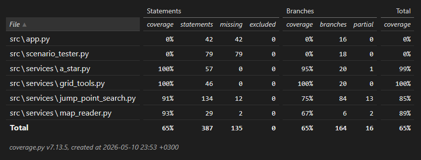

# Testausdokumentti
### Kattavuusraportti


### Testit

Algoritmit testataan suurella määrällä syötteitä käyttäen Moving AI Labin tarjoamia scen-tiedostoja. Tiedostossa annetaan mm. lähtö- ja maalipisteen koordinaatit sekä lyhimmän reitin optimipituuden. Scenario_tester.py käy läpi 100 pisintä skenaariota ja vertaa optimipituutta algoritmin ratkaisuun. Näin algoritmien toteutusta testataan useassa eri tilanteessa.

Sen lisäksi on muutama yksikkötesti, joilla pystyi muutoksen jälkeen nopeasti varmistamaan, että algoritmit toimivat odotetusti.

### Testien ajaminen
Yksikkötestit voidaan ajaa projektin juurihakemistosta komennolla
```
poetry run python -m pytest
```

scen-tiedostoilla testaaminen tapahtuu erillisellä scenario tester -ohjelmalla, joka ajetaan komennolla
```
poetry run python src/scenario_tester.py
```
Ohjelma ensin luettelee `src/tests/maps/`-polussa sijaitsevat map-tiedostot. Valmiiksi lisätyillä kartoilla on vastaava scen-tiedosto myös kansiossa. Kun käyttäjä on valinnut kartan, kaikki sen skenaariot käydään läpi. Ohjelma vertaa molemmilla algoritmeilla saadun polun pituutta odotettuun optimipituuteen ja tarkistaa, että algoritmien tuottamat pituudet ovat yhtä suuret. Lisäksi se vertailee algoritmien suorituksia ja kertoo, kuinka monessa skenaariossa kukin algoritmi oli nopeampi.
